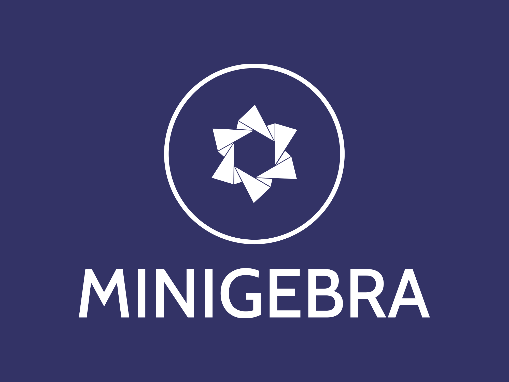

## MiniGebra
Small clone of GeoGebra. Work In Progress.

## Aim of the project
This clone will consist of simple graphical user interface for plotting mathematical functions. This project was created for class Scientific Computing in Python at VSB-TUO.

# Implemented features

* parsing of mathematical expressions
* simplification of mathematical expressions
* symbolic differentiation
* plotting of expressions/functions
* saving figures
* GUI

# Features that might be implemented in future

* plotting options
* ODE support
* systems of ODEs
* slope fields
* functions of two variables
* complex funtions
* parameters and their animations

